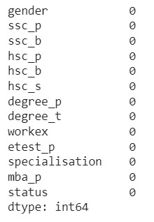
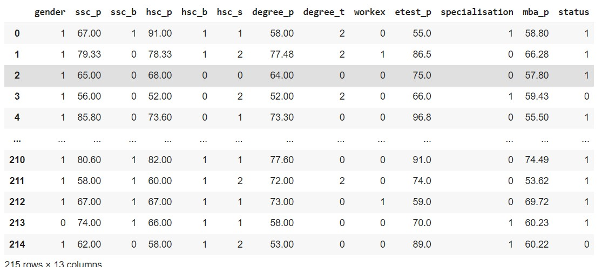
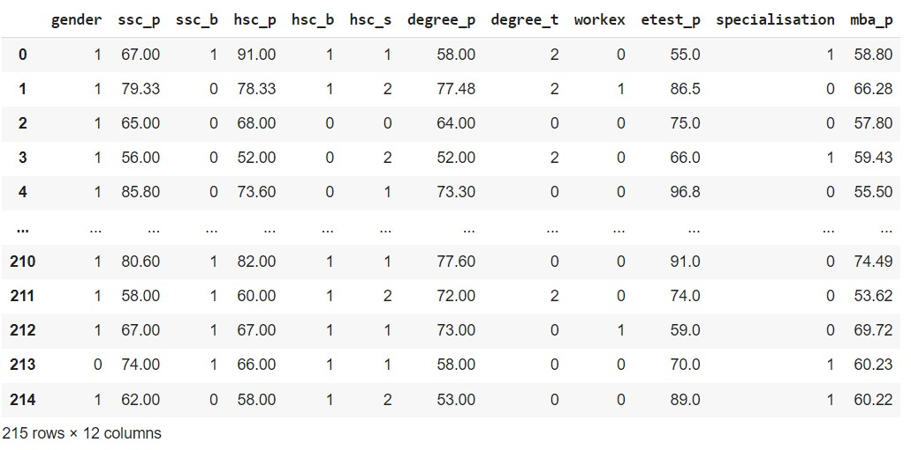
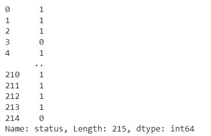

# Implementation-of-Logistic-Regression-Model-to-Predict-the-Placement-Status-of-Student

## AIM:
To write a program to implement the the Logistic Regression Model to Predict the Placement Status of Student.

## Equipments Required:
1. Hardware – PCs
2. Anaconda – Python 3.7 Installation / Jupyter notebook

## Algorithm
1. Import the standard libraries such as pandas module to read the corresponding csv file.
2. Upload the dataset values and check for any null or duplicated values using .isnull() and .duplicated() function respectively.
3. Import LabelEncoder and encode the corresponding dataset values.
4. Import LogisticRegression from sklearn and apply the model on the dataset using train and test values of x and y and Predict the values of array using the variable y_pred.
5. Calculate the accuracy, confusion and the classification report by importing the required modules such as accuracy_score, confusion_matrix and the classification_report from sklearn.metrics module.
6. Apply new unknown values and print all the acqirred values for accuracy, confusion and the classification report.
 

## Program:
```
/*
Program to implement the the Logistic Regression Model to Predict the Placement Status of Student.

Developed by: Ritika S
Register Number:  212221240046

import pandas as pd
data=pd.read_csv('Placement_Data.csv')
data.head()


data1=data.copy()
data1=data1.drop(["sl_no","salary"],axis = 1)#removes the specified row or column
data1.head()


data1.isnull().sum()


data1.duplicated().sum()


from sklearn.preprocessing import LabelEncoder
le=LabelEncoder()
data1["gender"] = le.fit_transform(data1["gender"])
data1["ssc_b"] = le.fit_transform(data1["ssc_b"])
data1["hsc_b"] = le.fit_transform(data1["hsc_b"])
data1["hsc_s"] = le.fit_transform(data1["hsc_s"])
data1["degree_t"] = le.fit_transform(data1["degree_t"])
data1["workex"] = le.fit_transform(data1["workex"])
data1["specialisation"] = le.fit_transform(data1["specialisation"])
data1["status"] = le.fit_transform(data1["status"])
data1


x=data1.iloc[:,:-1]
x


y=data1["status"]
y


from sklearn.model_selection import train_test_split
x_train,x_test,y_train,y_test=train_test_split(x,y,test_size = 0.2,random_state = 0)


from sklearn.linear_model import LogisticRegression
lr = LogisticRegression(solver = "liblinear")# a library for large
lr.fit(x_train,y_train)
y_pred = lr.predict(x_test)
y_pred


from sklearn.metrics import accuracy_score
accuracy = accuracy_score(y_test,y_pred)
(accuracy)


from sklearn.metrics import confusion_matrix
confusion = confusion_matrix(y_test,y_pred)
(confusion)


from sklearn.metrics import classification_report
classification_report1 = classification_report(y_test,y_pred)
print(classification_report1)


lr.predict([[1,80,1,90,1,1,90,1,0,85,1,85]])
*/  

```

## Output:
### 1.Placement data


### 2.Salary data


### 3.Checking the null() function


### 4. Data Duplicate


### 5. Print data


### 6. Data-status



### 7. y_prediction array


### 8.Accuracy value


### 9. Confusion array


### 10. Classification report


### 11.Prediction of LR


## Result:
Thus the program to implement the the Logistic Regression Model to Predict the Placement Status of Student is written and verified using python programming.
